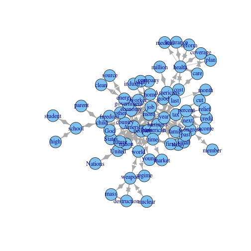
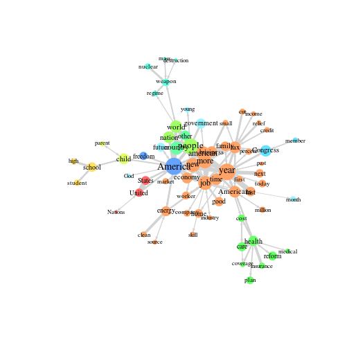

Creating semantic networks
========================================================

One way to create semantic networks is to calculate how often words co-occur together. This co-occurence reflects a semantic relation, because it indicates that the meaning of these words is related.

In this howto we demonstrate two functions to calculate the co-occurence of words. The first is the `coOccurenceNetwork` function, which calculates the co-occurence of words within documents based on a document term matrix. The second is the `windowedCoOccurenceNetwork`, which calculates how often words co-occur within a given word distance based on tokenized texts.

We start with a simple example. 


```r
library(semnet)
```

```
## Loading required package: plyr
## Loading required package: zoo
## 
## Attaching package: 'zoo'
## 
## The following objects are masked from 'package:base':
## 
##     as.Date, as.Date.numeric
## 
## Loading required package: wordcloud
## Loading required package: Rcpp
## Loading required package: RColorBrewer
## Loading required package: scales
## Loading required package: tm
## Loading required package: slam
## Loading required package: igraph
## Loading required package: Matrix
```

```r
data(simple_dtm)
dtm
```

```
## 6 x 7 sparse Matrix of class "dgTMatrix"
##   nuclear energy waste weapons bad war good
## 1       1      1     .       .   .   .    .
## 2       1      .     1       .   .   .    .
## 3       1      .     .       1   .   .    .
## 4       .      .     .       1   1   1    .
## 5       .      .     1       .   1   .    .
## 6       .      1     .       .   .   .    1
```


`dtm` is a document term matrix: the rows represent documents and the columns represent words. Values represent how often a word occured within a document. The co-occurence of words can then be calculated as the number of documents in which two words occur together. This is what the `coOccurenceNetwork` function does. 


```r
g = coOccurenceNetwork(dtm)
```

```
## Note: method with signature 'CsparseMatrix#Matrix#missing#replValue' chosen for function '[<-',
##  target signature 'dgCMatrix#nsCMatrix#missing#numeric'.
##  "Matrix#nsparseMatrix#missing#replValue" would also be valid
```

```r
plot(g, vertex.size = V(g)$freq * 10)
```

 


Of course, this method mainly becomes interesting when lots of documents are analyzed. This could for instance show how often the word 'nuclear' is used in the context of 'energy', compared to the context of 'weapons' and 'waste'. Thus, it can provide an answer to the question: if one think or talks about nuclear technology, what discourses, frames or topics come to mind?

To demonstrate the `windowedCoOccurenceNetwork` function we'll use a larger dataset, consisting of the state of the union speeches of Obama and Bush (1090 paragraphs). We'll filter the data on part-of-speech tags to contain only the nouns, names and adjectives.


```r
data(sotu)
sotu.tokens = sotu.tokens[sotu.tokens$pos1 %in% c("N", "M", "A"), ]
head(sotu.tokens)
```

```
##          word sentence pos      lemma offset       aid id pos1 freq
## 4  unfinished        1  JJ unfinished     10 111541965  4    A    1
## 5        task        1  NN       task     21 111541965  5    N    1
## 9       basic        1  JJ      basic     41 111541965  9    A    1
## 10    bargain        1  NN    bargain     47 111541965 10    N    1
## 14    country        1  NN    country     71 111541965 14    N    1
## 17       idea        1  NN       idea     84 111541965 17    N    1
```


We are interested in three columns in the `sotu.tokens` dataframe: 
* The `lemma` column, which is the lemma of a term (the non-plural basic form of a word). We use this instead of the word because we are interested in the meaning of words, for which it is generally less relevant in what specific form it is used. Thus, we consider the words "responsibility" and "responsibilities" to represent the same meaning.
* The `aid` column, which is a unique id for the document, in this case for a paragraph in the SotU speeches. We refer to this as the `context` in which a word occurs.
* The `id` column, which is the specific location of a term within a context. For example, the first row in sotu.tokens shows that in context `111541965`, the term `unfinished` was the fourth term.

These columns are the main arguments for the `windowedCoOccurenceNetwork` function. In addition, the `window.size` argument determines the word distance within which words need to occur to be counted as a co-occurence.


```r
g = windowedCoOccurenceNetwork(location = sotu.tokens$id, term = sotu.tokens$lemma, 
    context = sotu.tokens$aid, window.size = 20)
class(g)
```

```
## [1] "igraph"
```

```r
vcount(g)
```

```
## [1] 3976
```

```r
ecount(g)
```

```
## [1] 201792
```


The output `g` is an igraph object---a popular format for representing and working with graph/network data. `vcount(g)` shows that the number of vertices (i.e. terms) is 3976. `ecount(g)` shows that the number of edges is 201792. 

Naturally, this would not be an easy network to interpret. Therefore, we first filter on the most important vertices and edges. There are several methods to do so (see e.g., [Leydesdorff & Welbers, 2011]{http://arxiv.org/abs/1011.5209}). Here we use backbone extraction, which is a relatively new method (see [Kim & Kim, 2015]{http://jcom.sissa.it/archive/14/01/JCOM_1401_2015_A01}. Essentially, this method filters out edges that are not significant based on an alpha value, which can be interpreted similar to a p-value. To filter out vertices, we lower the alpha to a point where only the specified number of vertices remains.   


```r
g_backbone = getBackboneNetwork(g, alpha = 1e-04, max.vertices = 100)
```

```
## Used cutoff alpha 3.98523848383456e-05 to keep number of vertices under 100
## (For the edges the threshold assigned in the alpha parameter is still used)
```

```r
vcount(g_backbone)
```

```
## [1] 100
```

```r
ecount(g_backbone)
```

```
## [1] 255
```


Now there are only 100 vertices and 255 edge left. This is a network we can interpret. Let's plot!


```r
plot(g_backbone)
```

 


Nice, but still a bit messy. We can take some additional steps to focus the analysis and add additional information. First, we can look only at the largest connected component, thus ignoring small islands of terms such as `math` and `science`. 


```r
# select only largest connected component
g_backbone = decompose.graph(g_backbone, max.comps = 1)[[1]]
plot(g_backbone)
```

 


Next, it would be interesting to take into account how often each term occured. This can be visualized by using the frequency of terms to set the sizes of the vertices. Also, we can use colors to indicate different clusters.

The output of the (windowed)coOccurenceNetwork function by default contains the vertex attribute `freq`, which can be used to set the vertex sizes. To find clusters, several community detection algorithms are available. To use this information for visualization some basic understanding of plotting igraph objects is required, which is out of the scope of this tutorial. We do provide a function named `setNetworkAttributes` which deals with these and some other visualization attributes. 


```r
# add vertex cluster membership based on edge.betweenness.community
# clustering
V(g_backbone)$cluster = edge.betweenness.community(g_backbone)$membership

g_backbone = setNetworkAttributes(g_backbone, size_attribute = V(g_backbone)$freq, 
    cluster_attribute = V(g_backbone)$cluster)

plot(g_backbone)
```

 


Now we have a more focused and informational visualization. We can for instance see several clusters that represent important talking points, such as the health care debate and the issue of nuclear weapons. Also, we see that America is at the center of discussions, in particular in context of economy and the job market.

