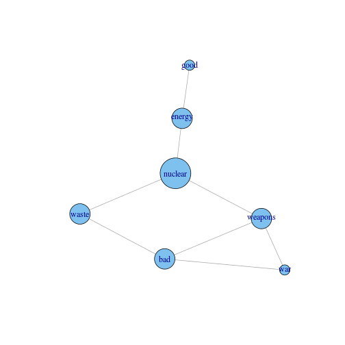
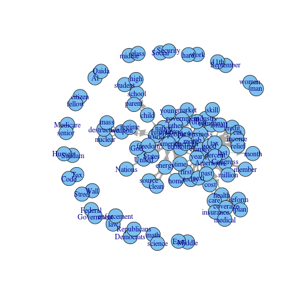

Creating semantic networks
========================================================

One way to create semantic networks is to calculate how often words co-occur together, which indicates that the meaning of these words is related.

In this howto we demonstrate two functions to calculate the co-occurence of words. The first is the `coOccurenceNetwork` function, which calculates the co-occurence of words within documents based on a document term matrix. The second is the `windowedCoOccurenceNetwork`. This function uses tokens lists to calculate how often words co-occure within a given word distance.

To introduce the concept, we start with a simple example. 


```r
library(semnet)
```

```
## Loading required package: plyr
## Loading required package: zoo
## 
## Attaching package: 'zoo'
## 
## The following objects are masked from 'package:base':
## 
##     as.Date, as.Date.numeric
## 
## Loading required package: wordcloud
## Loading required package: Rcpp
## Loading required package: RColorBrewer
## Loading required package: scales
## Loading required package: tm
## Loading required package: slam
## Loading required package: igraph
## Loading required package: Matrix
```

```r
data(simple_dtm)
dtm
```

```
## 6 x 7 sparse Matrix of class "dgTMatrix"
##   nuclear energy waste weapons bad war good
## 1       1      1     .       .   .   .    .
## 2       1      .     1       .   .   .    .
## 3       1      .     .       1   .   .    .
## 4       .      .     .       1   1   1    .
## 5       .      .     1       .   1   .    .
## 6       .      1     .       .   .   .    1
```


`dtm` is a simple document term matrix: the rows represent documents and the columns represent words. Values represent how often a word occured within a document. The co-occurence of words can then be calculated as the number of documents in which two words occur together. This is what the `coOccurenceNetwork` function does.


```r
g = coOccurenceNetwork(dtm)
```

```
## Note: method with signature 'CsparseMatrix#Matrix#missing#replValue' chosen for function '[<-',
##  target signature 'dsCMatrix#nsCMatrix#missing#numeric'.
##  "Matrix#nsparseMatrix#missing#replValue" would also be valid
```

```r
plot(g, vertex.size = V(g)$freq * 10)
```

 


Of course, this method mainly becomes interesting when lots of documents are analyzed. This could for instance show how often the word 'nuclear' is used in the more positive context of 'energy', compared to the more negative context of 'weapons' and 'waste'.

To demonstrate the `windowedCoOccurenceNetwork` function we'll use a larger dataset, consisting of the state of the union speeches of Obama and Bush (1090 paragraphs). We'll filter the data on part-of-speech tags to contain only the nouns, names and adjectives.


```r
data(sotu)
sotu.tokens = sotu.tokens[sotu.tokens$pos1 %in% c("N", "M", "A"), ]
head(sotu.tokens)
```

```
##          word sentence pos      lemma offset       aid id pos1 freq
## 4  unfinished        1  JJ unfinished     10 111541965  4    A    1
## 5        task        1  NN       task     21 111541965  5    N    1
## 9       basic        1  JJ      basic     41 111541965  9    A    1
## 10    bargain        1  NN    bargain     47 111541965 10    N    1
## 14    country        1  NN    country     71 111541965 14    N    1
## 17       idea        1  NN       idea     84 111541965 17    N    1
```


The `windowedCoOccurenceNetwork` function requires 3 vectors as input. 
1. location: an integer vector indicating what the location of the term is in a context. This is the `id` column in the `sotu.tokens` data. 
2. term: a character vector indicating what the term is. For this we use the `lemma` column.
3. context: a vector indicating the context, e.g., a document, paragraph or sentence. For this we use the `aid` column, which represents the uniuqe id of a paragraph in the speeches.

The window.size parameter determines the word distance within which words need to occur to be counted as a co-occurence.


```r
g = windowedCoOccurenceNetwork(location = sotu.tokens$id, term = sotu.tokens$lemma, 
    context = sotu.tokens$aid, window.size = 20)
class(g)
```

```
## [1] "igraph"
```

```r
vcount(g)
```

```
## [1] 3976
```

```r
ecount(g)
```

```
## [1] 201792
```


The output `g` is an igraph object. `vcount(g)` shows that the number of vertices (i.e. terms) is 3976. `ecount(g)` shows that the number of edges is 201792. Naturally, this would not be an easy network to interpret. Therefore, we first filter on the most important vertices and edges. 

There are several methods to filter on vertices and edges. Here we use backbone extraction, which is a relatively new method. Essentially, this method filters out edges that are not significant based on an alpha value, which can be interpreted similar to a p-value. To filter out vertices, we lower the alpha to a point where only the specified number of vertices remains.   


```r
g_backbone = getBackboneNetwork(g, alpha = 1e-04, max.vertices = 100, use.original.alpha = T)
```

```
## Used cutoff alpha 3.98523848383456e-05 to keep number of vertices under 100
## (For the edges the threshold assigned in the alpha parameter is still used)
```

```r
vcount(g_backbone)
```

```
## [1] 100
```

```r
ecount(g_backbone)
```

```
## [1] 255
```


Now there are only 100 vertices and 255 edge left. This is a network we can interpret. Let's plot!


```r
plot(g_backbone, vertex.size = 0, edge.arrow.size = 0)
```

 


Nice, but still a bit messy. We can take some additional steps to facilitate interpretation. First, we can look only at the largest connected component, thus filtering out small islands of words such as `math` and `science`. Also, we can use a clustering method to color the vertices. We also made a `setNetworkAttributes` function which sets default plotting parameters for this type and size of network.


```r
# select only largest connected component
g_backbone = decompose.graph(g_backbone, max.comps = 1)[[1]]

# add vertex cluster membership based on edge.betweenness.community
# clustering
V(g_backbone)$cluster = edge.betweenness.community(g_backbone)$membership

# Set some default plotting parameters. size_attribute is set to 'freq',
# which is a vertex attribute (V(g)$freq) that comes standard with the
# (windowed)coOccurenceNetwork function. This is used to determine vertex
# and vertex label sizes. the cluster_attribute uses the cluster membership
# calculated above to color vertices.
g_backbone = setNetworkAttributes(g_backbone, size_attribute = "freq", cluster_attribute = "cluster")

plot(g_backbone)
```

 


